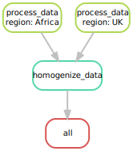

# Using machine learning and big data to explore the drug resistance landscape in HIV

This is the main repository for [this article](http://doi.org/bioxrivDOI).  
It contains the pipelines used to process and generate data and results, the notebooks used to process the results and generate figures, as well as the publicly available data used in this study.  
The processed results used to generate figures are also available in this repository. 

## Prerequisites

To be able to run this pipeline several steps are needed.

### dependencies

for this pipeline you will need `python >= 3.6`, `snakemake>=5.26.1` and the packages specified in `utils_hiv/requirements.txt`. To install the necessary package in a [conda](https://docs.conda.io/projects/conda/en/latest/user-guide/install/index.html) virtual environment run:

```shell
$ cd /path/to/this/directory
$ conda create -n pipelineDRMs python=3.7 snakemake">=5.26.1" -y
$ conda activate pipelineDRMs
$ pip install -e utils_hiv
```

### Alignment data

For this pipeline to run you will need several alignments of HIV-1 pol RT sequences from at least 2 datasets: a training set and at least one testing set.  
Each training/testing set is composed of a FASTA alignment of treatment-naive sequences and another of treatment-experienced sequences.  
To get the positions of each residue w.r.t. the reference HXB2 sequence and get a suitable format for encoding, you should upload each of your alignments `trainNaive.fa`, `trainTreated.fa`, `testNaive.fa` and `testTreated.fa` into [Stanford's HIVdb program](https://hivdb.stanford.edu/hivdb/by-sequences/). For each uploaded alignment you will get the `PrettyRTAA.tsv` and `ResistanceSummary.tsv` files which are need for dataset encoding.  
In our study the training data corresponds to the UK dataset, and the testing data corresponds to the African dataset  

### Available sequence data
The African data produced by Peeters *et al.* is available in the `data/African_dataset` directory. This dataset is composed of 2 FASTA files, `naive.fa` that contains all sequences of RTI-naive individuals, and `treated.fa` which contains sequences from RTI-experienced individuals.  
Additionaly a metadata file we produced with information derived from sequence ids, treatment status and extra output from the Stanford HIVDB algorithms, was made readily available in the form of a .TSV file. 

### Produced results
We also provide the result files generated during our study and used to create the manuscript figures. These files are presented as .TSV files in the `data/results` directory.  
The `data/results/Base_results` directory contains results produced by discriminatinng RTI-naive from RTI-experienced sequences, for the dataset with all features, with known RAM features removed and with known RAM features and sequences removed. 
The `data/results/Alternate_target_results` directory contains result produced by discriminating RTI-naive from RTI-experienced sequences, as well as discriminating sequences with at least one known RAM from sequences that have none, for the dataset with known RAM features removed.  
In both of these directories the `all_preds.tsv` file contains all the predictions done on all available test sets, by all trained models with the true label. The `coefs_df.tsv` contains the importance values for alltrained classifiers. 

## pipelines

### data preprocessing pipeline

This pipeline takes the files generated above by Stanford's HIVdB and encodes them to vectorial form.  
The pipeline takes as input the directory where those files are stored, each dataset you want to encode must be in a separate subdirectory. The pipeline also needs a directory where metadata files are located.  
In our example we want to encode 2 datasets, a UK dataset and an African dataset, so our directory and files should look like this:

```
.
├── data_dir
│   ├── Africa
│   │   ├── PrettyRT_naive.tsv
│   │   ├── PrettyRT_treated.tsv
│   │   ├── ResistanceSummary_naive.tsv
│   │   └── ResistanceSummary_treated.tsv
│   └── UK
│       ├── PrettyRT_naive.tsv
│       ├── PrettyRT_treated.tsv
│       ├── ResistanceSummary_naive.tsv
│       └── ResistanceSummary_treated.tsv
└── metadata_dir
    ├── Africa-metadata.tsv
    └── UK-metadata.tsv
```

The pipeline looks as follows, with the `process_data` rule encoding sequences as binary vectors of mutation presence/absence, and the `homogenize_data` rule making sure all encoded datasets have the same set of features so that classifiers trained on one dataset can predict labels for another.

<p align="center">
    
</p>

### main training pipeline

This pipeline trains the classifiers on a training set and gets predictions on a testing set. The inputs are specified in the `config.yaml` configuration file. The input data is the one generated by the preprocessing pipeline.

The pipeline takes as input and encoded training and testing set (ie. the UK dataset) and any number of external testing sets (ie the African dataset).

All configuration options are described and listed in the configuration file `config.yaml` which must be given to the pipeline.

The following figure shows a run for our pipeline, we specified the following options:

- we want 3 models trained: Random Forest _(RF)_, Naive Bayes _(Bayes)_ and Logistic regression _(Logistic)_
- we want 3 training sessions:
  - training on B subtype of the training set and testing on C subtype of the training set
  - training on C subtype of the training set and testing on B subtype of the training set
  - training on All subtypes of the training set and testing on All subtypes of the external testing set

<p align="center">
    
</p>

In an actual run of this pipeline we might want to also increase the number of repeated training sessions for models such as Random Forests that have a random aspect.

To execute the pipeline execute the following steps:

```shell
$ conda activate pipelineDRMs
$ snakemake \
    --snakefile=Snakefile_main.smk \
    --configfile=path/to/config.yml \
    --kep-going \
    --jobs [nb. of cores/threads to use]
```

To execute this pipeline in a SLURM cluster environment _(fill out partition/account name and qos accordingly)_:

```shell
$ module load [modules] # (ie. conda, python, ...)
$ conda activate pipelineDRMs
$ snakemake \
    --snakefile=Snakefile_main.smk \
    --configfile=path/to/config.yml \
    --keep-going \
    --cluster "sbatch -c {threads} -o {params.logs}/{params.name}.log -e {params.logs}/{params.name}.log --mem {params.mem} -p [partition name] --qos=[qos name] -A [account name] -J {params.name}" \
    --jobs [nb. of cores/threads to use]
```

For more information on pipeline execution in HPC cluster environments see the [snakemake documentation](https://snakemake.readthedocs.io/en/stable/executing/cluster.html)

## Scripts

The results from the main pipeline can then be processed by the `gather_results.py` script. This script takes as input the list of result directories that were created by the pipeline and outputs a concatenated tab-delimited file with all predictions, as well as a concatenated tab-delimited file containing the importances/weights assigned by all trained models to the dataset features. This script can also be used to concatenate the results of several runs of the main pipeline.
These files can then be used for interpretation and figure generation (several examples in the `notebooks` directory).
